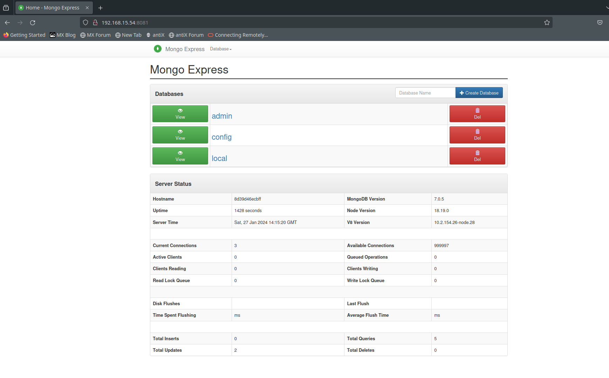

# CentOS 9 Stream VM Setup Script

Este script automatiza a instalação de pacotes e configurações iniciais em uma máquina virtual CentOS 9 Stream. Ele inclui a instalação do Docker, Oracle Database via **docker image**, SDKMAN! para gerenciamento de SDKs e Oh My Posh para melhorar o prompt do Bash.

## Uso

* Baixar o **script** [aqui](httts://github.com/lasbrDev/script-centosvm-devops)
* Descompactar o arquivo .zip
* Acessar o arquivo descompactado pelo terminal:

```bash
cd Downloads
ls
cd script-centosvm-devops-main
ls
sudo su
Password:
chmod +x script-centosvm-devops.sh
./script-centosvm-devops.sh
```


## Pré-requisitos
* Máquina virtual CentOS 9 Stream
* Permissões de administrador (sudo)

## Componentes Instalados

* Git, Neofetch, Neovim
* Docker
* Oracle Database - docker image
* MongoDB - docker image
* Tomcat - docker image
* Wildfly - docker image
* Jenkins - docker image
* MySQL - docker image
* PostgreSQL - docker image
* PGAdmin - docker image
* SDKMAN!
* Oh My Posh com o tema amro

## Configurações Adicionais

Atenção para o acesso ao MongoExpress em localhost. Ao acessar o endereço http://localhost:8081, é necessário fornecer as credenciais. Username: admin, Password: pass.
Adicionalmente, incluí um arquivo docker-compose.yml para configurar o MongoDB, proporcionando maior flexibilidade aos projetos. Lembre-se de ajustar as configurações conforme necessário.

`Nota:` Este procedimento é aplicável apenas nos casos em que você está iniciando a imagem do MongoDB sem especificar o parâmetro do endereço IP da máquina virtual.

### Permitindo conexões externas

```bash
docker exec -it mongo_dev bash
```
```bash
apt updade && apt upgrade -y
```
```bash
apt-get install neovim -y
```
```bash
nvim /etc/mongod.conf.orig
```
`Nota1:` alterar a linha:
```bash
# network interfaces
net:
  port: 27017
  bindIp: 127.0.0.1
```
Para:
```bash
# network interfaces
net:
  port: 27017
  bindIp: 0.0.0.0
```



## Atenção

* Certifique-se de revisar e ajustar as configurações do script de acordo com suas necessidades.
* O script foi testado no ambiente CentOS 9 Stream, pode precisar de ajustes em outros ambientes.

