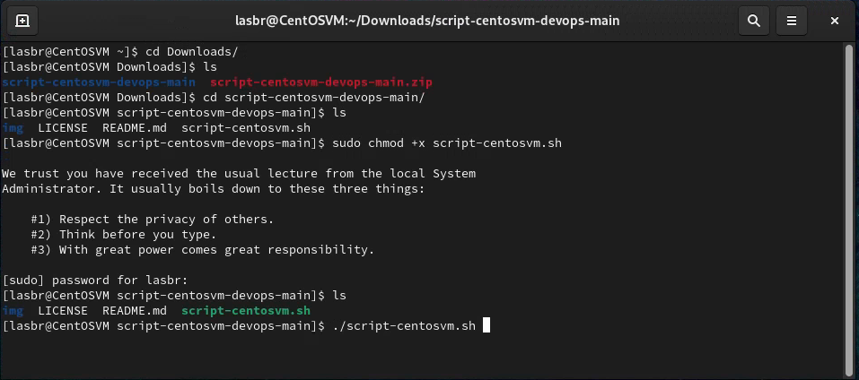

# CentOS 9 Stream VM Setup Script

Este script automatiza a instalação de pacotes e configurações iniciais em uma máquina virtual CentOS 9 Stream. Ele inclui a instalação do Docker, Oracle Database via **docker image**, SDKMAN! para gerenciamento de SDKs e Oh My Posh para melhorar o prompt do Bash.

## Uso

* Baixar o **script** [aqui](httts://github.com/lasbrDev/script-centosvm-devops)
* Descompactar o arquivo .zip
* Acessar o arquivo descompactado pelo terminal:

```bash
cd Downloads
ls
cd script-centosvm-devops-main
ls
sudo su
Password:
chmod +x script-centosvm-devops.sh
./script-centosvm-devops.sh
```


## Pré-requisitos
* Máquina virtual CentOS 9 Stream
* Permissões de administrador (sudo)

## Componentes Instalados

* Git, Neofetch, Neovim
* Docker
* Oracle Database - docker image
* SDKMAN!
* Oh My Posh com o tema amro

## Configurações Adicionais

O script também cria uma rede Docker chamada REDEOCL e configura a porta 1521 no firewall.

## Notas

* Certifique-se de revisar e ajustar as configurações do script de acordo com suas necessidades.
* O script foi testado no ambiente CentOS 9 Stream, pode precisar de ajustes em outros ambientes.

